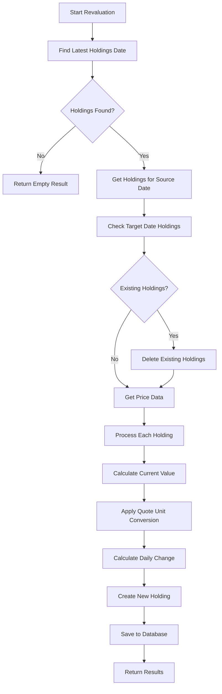

# Holding Revaluation Service

The `IHoldingRevaluationService` provides comprehensive functionality for revaluing portfolio holdings based on current market prices stored in the `instrument_prices` table. This service handles the complete process of copying holdings from the latest available date and applying new valuations with proper quote unit conversions.

## Overview

The holding revaluation process involves:
1. **Source Identification**: Finding the latest available valuation date with holdings
2. **Price Lookup**: Retrieving market prices for the target valuation date
3. **Quote Unit Conversion**: Converting prices from GBX (pence) to GBP (pounds) as needed
4. **Value Calculation**: Computing current values and daily profit/loss changes
5. **Data Persistence**: Saving revalued holdings to the database

## Key Features

- **Automatic Source Detection**: Uses the most recent holdings as the baseline
- **Quote Unit Support**: Handles GBP (pounds) and GBX (pence) conversions automatically
- **Daily Change Calculation**: Computes profit/loss changes from previous valuations
- **Bulk Processing**: Efficiently processes all holdings in a single operation
- **Error Handling**: Gracefully handles missing price data with detailed reporting
- **Replacement Logic**: Automatically replaces existing holdings for the target date

## Quote Unit Conversions

The service supports multiple quote units with automatic conversions:

| Quote Unit | Description | Conversion |
|------------|-------------|------------|
| **GBP** | British Pounds | No conversion (1:1) |
| **GBX** | Pence | Divide by 100 (100p = £1) |
| **NULL** | Unknown/Default | Treated as GBP |

### Conversion Examples

```csharp
// GBP Example: 100 shares @ £150.25 = £15,025.00
UnitAmount: 100
Price: 150.25 (GBP)
Current Value: 100 × 150.25 = £15,025.00

// GBX Example: 100 shares @ 15025p = £15,025.00
UnitAmount: 100  
Price: 15025 (GBX)
Adjusted Price: 15025 ÷ 100 = £150.25
Current Value: 100 × 150.25 = £15,025.00
```

## Usage Examples

### Basic Revaluation

```csharp
public async Task<HoldingRevaluationResult> RevalueForToday(
    IHoldingRevaluationService revaluationService)
{
    var today = DateOnly.FromDateTime(DateTime.Today);
    return await revaluationService.RevalueHoldingsAsync(today);
}
```

### Processing Results

```csharp
var result = await revaluationService.RevalueHoldingsAsync(valuationDate);

Console.WriteLine($"Processed {result.TotalHoldings} holdings");
Console.WriteLine($"Successfully revalued: {result.SuccessfulRevaluations}");
Console.WriteLine($"Failed revaluations: {result.FailedRevaluations}");
Console.WriteLine($"Duration: {result.Duration.TotalMilliseconds}ms");

// Handle failed instruments
foreach (var failed in result.FailedInstruments)
{
    Console.WriteLine($"Failed: {failed.ISIN} - {failed.ErrorMessage}");
}
```

## API Endpoints

The service is exposed via REST API endpoints:

### Revalue Holdings for Specific Date
```http
POST /api/holdingrevaluation/revalue/{valuationDate}
```

**Parameters:**
- `valuationDate`: Date in YYYY-MM-DD format

**Example:**
```bash
curl -X POST "https://api.portfoliomanager.com/api/holdingrevaluation/revalue/2024-10-07"
```

### Revalue Holdings for Today
```http
POST /api/holdingrevaluation/revalue/today
```

**Example:**
```bash
curl -X POST "https://api.portfoliomanager.com/api/holdingrevaluation/revalue/today"
```

## Response Format

```json
{
  "valuationDate": "2024-10-07",
  "sourceValuationDate": "2024-10-06", 
  "totalHoldings": 150,
  "successfulRevaluations": 148,
  "failedRevaluations": 2,
  "replacedHoldings": 0,
  "duration": "00:00:02.1234567",
  "processedAt": "2024-10-07T09:30:00.000Z",
  "failedInstruments": [
    {
      "isin": "GB00B03MLX29",
      "instrumentName": "Royal Dutch Shell",
      "errorMessage": "No price data available", 
      "errorCode": "NO_PRICE_DATA"
    }
  ]
}
```

## Process Flow



## Database Operations

The service performs the following database operations:

1. **Read Operations:**
   - Find latest valuation date: `holdings` table
   - Retrieve source holdings: `holdings` + `instruments` (JOIN)
   - Get price data: `instrument_prices` table
   - Check existing target holdings: `holdings` table

2. **Write Operations:**
   - Delete existing holdings: `holdings` table (if replacing)
   - Insert revalued holdings: `holdings` table (batch insert)

## Error Handling

The service handles various error scenarios:

| Error Code | Description | Resolution |
|------------|-------------|------------|
| **NO_PRICE_DATA** | No price found for instrument | Skip revaluation, report in failed list |
| **CALCULATION_ERROR** | Exception during value calculation | Skip revaluation, log error |
| **NO_SOURCE_HOLDINGS** | No previous holdings found | Return empty result |

## Performance Considerations

- **Batch Operations**: Uses bulk operations for database efficiency
- **Memory Management**: Processes holdings in memory for fast calculations  
- **Connection Pooling**: Leverages EF Core connection pooling
- **Parallel Safe**: Thread-safe for concurrent revaluation requests

## Prerequisites

Before using the revaluation service:

1. **Price Data**: Ensure `instrument_prices` table has current market prices
2. **Holdings Data**: Must have at least one previous day's holdings
3. **Instrument Setup**: All instruments should have appropriate quote units configured

## Configuration

Service registration in `ServiceCollectionExtensions.cs`:

```csharp
services.AddScoped<IHoldingRevaluationService, HoldingRevaluationService>();
```

## Testing

The service includes comprehensive unit tests covering:

- ✅ Empty holdings scenarios
- ✅ Quote unit conversions (GBP vs GBX)  
- ✅ Daily change calculations
- ✅ Error handling for missing prices
- ✅ Replacement of existing holdings

## Integration Points

The revaluation service integrates with:

- **Price Fetching Service**: Requires current price data in `instrument_prices`
- **Holdings Retrieval**: Works with existing holdings in the database
- **Portfolio Ingest**: Can be used after importing new portfolio data
- **Reporting Services**: Provides revalued data for portfolio reports

## Limitations

- **Currency Assumption**: Currently assumes all values in GBP base currency
- **FX Conversion**: Does not perform foreign exchange conversions
- **Quote Units**: Limited to GBP and GBX (extensible for other units)
- **Business Days**: Does not validate business day calendars