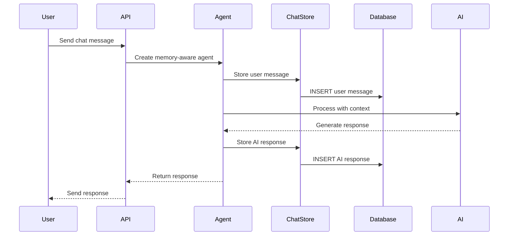

# Portfolio Manager Memory Architecture

## Overview

The Portfolio Manager implements a sophisticated memory system using the Microsoft Agent Framework to provide persistent conversation history and context-aware AI interactions. This enables continuous, intelligent conversations that remember previous interactions and provide personalized responses.

## Architecture Components

### 1. Database Schema

The memory system uses three primary entities in PostgreSQL:

#### ConversationThread
- **Purpose**: Groups related messages into conversation sessions
- **Scope**: Account-specific isolation
- **Key Fields**:
  - `account_id`: Links threads to specific user accounts
  - `thread_title`: Human-readable conversation identifier
  - `is_active`: Tracks currently active conversations
  - `last_activity`: Timestamp of most recent interaction

#### ChatMessage
- **Purpose**: Stores individual messages from users and AI
- **Features**:
  - Message content and role (User/Assistant)
  - Token count tracking for context window management
  - JSON metadata for extensibility
  - Automatic timestamping

#### MemorySummary
- **Purpose**: Daily conversation summaries for long-term context
- **Features**:
  - Automatic daily summarization
  - Key insights extraction
  - Performance optimization for large conversation histories

### 2. Microsoft Agent Framework Integration

#### PostgreSqlChatMessageStore
- **Inherits**: `Microsoft.Agents.AI.ChatMessageStore`
- **Responsibility**: Persistent storage of conversation messages
- **Features**:
  - Real-time message persistence
  - Context window management (last 50 messages)
  - Thread-scoped message retrieval
  - Automatic conversation thread creation

#### PortfolioMemoryContextProvider  
- **Inherits**: `Microsoft.Agents.AI.AIContextProvider`
- **Responsibility**: Provides contextual information to AI agents
- **Features**:
  - Conversation insights extraction
  - Memory state serialization
  - Context enhancement before AI invocation

### 3. Application Layer

#### ConversationThreadService
- **Purpose**: Business logic for thread management
- **Operations**:
  - Get or create active threads
  - Thread lifecycle management
  - Account-scoped thread operations

#### AiOrchestrationService
- **Purpose**: Coordinates AI interactions with memory
- **Features**:
  - Memory-aware agent creation
  - Graceful fallback to non-memory processing
  - Factory pattern for runtime component creation

## Memory Persistence Flow

### 1. Message Storage Timeline



### 2. Context Retrieval

When processing a new message:
1. **Thread Resolution**: Get or create conversation thread for account
2. **Message History**: Load last 50 messages from thread
3. **Context Enhancement**: Extract conversation insights
4. **AI Processing**: Provide enriched context to AI agent
5. **Response Generation**: AI responds with full conversation context

### 3. Automatic Thread Management

- **New Conversations**: Automatically create threads with descriptive titles
- **Thread Continuity**: Maintain context across multiple interactions
- **Activity Tracking**: Update `last_activity` timestamp on each message
- **Account Isolation**: Each account has separate conversation spaces

## API Integration

### Memory-Enabled Endpoints

#### `/api/ai/chat/query`
- **Method**: POST
- **Features**: Synchronous chat with memory
- **Request**: 
  ```json
  {
    "query": "What's my portfolio performance?",
    "accountId": 1,
    "threadId": 123  // Optional - auto-creates if omitted
  }
  ```
- **Response**:
  ```json
  {
    "response": "Based on our previous discussion...",
    "queryType": "PortfolioAnalysis",
    "threadId": 123,
    "threadTitle": "Portfolio Performance Analysis"
  }
  ```

#### `/api/ai/chat/stream`
- **Method**: POST
- **Features**: Streaming responses with memory
- **Same request/response pattern with real-time streaming**

### Graceful Degradation

If memory components fail:
1. **Error Logging**: Log memory component failures
2. **Fallback Processing**: Continue with standard AI processing
3. **User Experience**: No interruption to user interactions
4. **Monitoring**: Track memory system health

## Configuration

### Dependency Injection Setup

```csharp
// Infrastructure Layer - Factory Registration
services.AddTransient<Func<int, int?, JsonSerializerOptions?, ChatMessageStore>>(
    serviceProvider => (accountId, threadId, jsonOptions) => 
        new PostgreSqlChatMessageStore(/* ... */));

services.AddTransient<Func<int, IChatClient, AIContextProvider>>(
    serviceProvider => (accountId, chatClient) => 
        new PortfolioMemoryContextProvider(/* ... */));
```

### Agent Creation

```csharp
var agent = chatClient.CreateAIAgent(new ChatClientAgentOptions
{
    Instructions = "You are a portfolio assistant...",
    ChatOptions = new ChatOptions { Tools = portfolioTools },
    ChatMessageStoreFactory = ctx => chatMessageStoreFactory(accountId, threadId, ctx.JsonSerializerOptions),
    AIContextProviderFactory = ctx => memoryContextProviderFactory(accountId, chatClient)
});
```

## Performance Considerations

### Context Window Management
- **Message Limit**: Only loads last 50 messages per thread
- **Token Estimation**: Tracks approximate token usage
- **Automatic Cleanup**: Older messages remain in database but excluded from active context

### Database Optimization
- **Indexes**: Optimized queries on `account_id`, `conversation_thread_id`, and timestamps
- **Cascade Deletes**: Automatic cleanup when accounts or threads are removed
- **Connection Pooling**: Efficient database connection management

### Memory Usage
- **Factory Pattern**: Components created on-demand per request
- **Stateless Services**: No persistent in-memory state
- **Serialization**: Efficient JSON serialization for state persistence

## Monitoring & Debugging

### Logging Events
- **Thread Creation**: New conversation thread establishment
- **Memory Operations**: Message storage and retrieval
- **Error Handling**: Memory component failures with fallback
- **Performance**: Context loading and processing times

### Health Checks
- **Database Connectivity**: PostgreSQL connection health
- **Memory Components**: Factory registration validation
- **AI Service**: Azure OpenAI service availability

## Migration & Deployment

### Database Migrations
- **Schema Evolution**: EF Core migrations for memory tables
- **Data Preservation**: Existing conversations maintained across updates
- **Version Compatibility**: Backward-compatible schema changes

### Container Deployment
- **Docker Support**: Fully containerized with PostgreSQL
- **Environment Configuration**: Configurable connection strings and AI endpoints
- **Scaling**: Stateless design supports horizontal scaling

## Security & Privacy

### Data Protection
- **Account Isolation**: Complete separation of conversation data by account
- **Encrypted Storage**: Database-level encryption support
- **Retention Policies**: Configurable data retention and cleanup

### Access Control
- **Authentication**: Account-based access control
- **Authorization**: Thread-level permissions
- **Audit Trail**: Complete message history with timestamps

## Future Enhancements

### Planned Features
- **Conversation Search**: Full-text search across message history
- **Memory Summarization**: Intelligent conversation summarization
- **Context Prioritization**: Smart context selection based on relevance
- **Multi-Modal Memory**: Support for images and documents in conversations
- **Export/Import**: Conversation backup and migration tools

### Scalability Improvements
- **Distributed Caching**: Redis integration for high-traffic scenarios
- **Read Replicas**: Database read scaling for memory retrieval
- **Async Processing**: Background memory summarization and optimization

---

## Technical Implementation Details

This memory system represents a production-ready implementation of persistent AI conversation memory using industry-standard patterns and the Microsoft Agent Framework. The architecture ensures reliability, performance, and scalability while maintaining clean separation of concerns and comprehensive error handling.