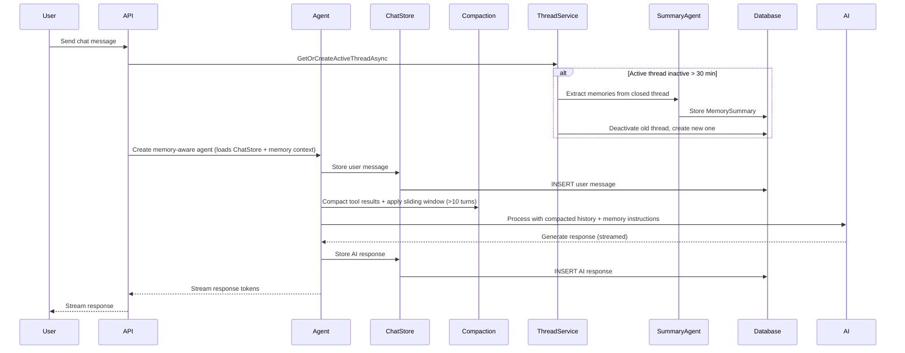

# Portfolio Manager Memory Architecture

## Overview

The Portfolio Manager implements a sophisticated memory system using the Microsoft Agent Framework to provide persistent conversation history and context-aware AI interactions. This enables continuous, intelligent conversations that remember previous interactions and provide personalized responses.

## Architecture Components

### 1. Database Schema

The memory system uses three primary entities in PostgreSQL:

#### ConversationThread
- **Purpose**: Groups related messages into conversation sessions
- **Scope**: Account-specific isolation
- **Key Fields**:
  - `account_id`: Links threads to specific user accounts
  - `thread_title`: Human-readable conversation identifier
  - `is_active`: Tracks currently active conversations
  - `last_activity`: Timestamp of most recent interaction

#### ChatMessage
- **Purpose**: Stores individual messages from users and AI
- **Features**:
  - Message content and role (User/Assistant)
  - Token count tracking for context window management
  - JSON metadata for extensibility
  - Automatic timestamping

#### MemorySummary
- **Purpose**: AI-generated conversation summary, one row per conversation thread once it is closed
- **Features**:
  - Intelligent conversation summarization using a dedicated AI agent (`MemoryExtractionService`)
  - Extracts `Summary`, `KeyTopics` (JSON, includes `importantFacts`), and `UserPreferences` (JSON)
  - One summary is created when a thread closes — **not** continuously during the conversation
  - Only recently-created summaries are ever read back into context (see "Known Limitation" below) — there is no separate long-term/permanent fact store

### 2. Microsoft Agent Framework Integration

#### PostgreSqlChatMessageStore
- **Inherits**: `Microsoft.Agents.AI.ChatMessageStore`
- **Responsibility**: Persistent storage of conversation messages
- **Features**:
  - Real-time message persistence
  - Context window management (last 50 messages)
  - Thread-scoped message retrieval
  - Automatic conversation thread creation

#### CompactionProvider pipeline (in-session, per-request)
- Configured in `AiOrchestrationService.SetupMemoryAwareAgent` as a `PipelineCompactionStrategy` with two stages, run on the messages loaded from `PostgreSqlChatMessageStore` before every model call:
  1. **ToolResultCompactionStrategy** — compacts verbose MCP tool result payloads (holdings JSON, market data) into YAML summaries whenever the conversation contains tool calls
  2. **SlidingWindowCompactionStrategy** — once a thread exceeds **10 turns**, drops the oldest turns down to the last **5** (`minimumPreservedTurns: 5`)
  - This replaced the earlier `SummarizationCompactionStrategy` (see commit `dc2c20d`) because summarization added an extra ~60s LLM call per request and could leak stale context. The trade-off is that anything stated only in the dropped early turns (e.g. a name mentioned once at the start of a long session) is no longer sent to the model for the rest of that session, unless it was also captured in `MemorySummary`.

#### PortfolioMemoryContextProvider  
- **Inherits**: `Microsoft.Agents.AI.AIContextProvider`
- **Responsibility**: Injects `Instructions` (not `Messages`) into the agent before each invocation, built from `MemorySummary` rows using a tiered, token-budgeted approach (~2000 token budget total):
  - **Tier 1 — Essential facts** (`LoadEssentialFactsAsync`): looks only at the **3 most recent** `MemorySummary` rows for the account, takes at most **2** `importantFacts` per summary that match identity/goal keywords (`name`, `called`, `i'm`, `i am`, `investment goal`, `risk tolerance`, ...), merges them into a set, then displays only the **top 3** (alphabetically). Core preferences (`RiskTolerance`, `CommunicationStyle`, `InvestmentGoal`) are surfaced the same way.
  - **Tier 2 — Hot memory**: full-detail summaries from the last 7 days (up to 3), included while the token budget allows
  - **Tier 3 — Warm memory**: compressed summaries from 7–30 days ago (up to 3), included with any remaining budget
  - **Note**: `InvokedCoreAsync` (which previously ran `ExtractConversationInsightsAsync`/`UpdateUserPreferencesAsync` in a fire-and-forget `Task.Run` after each response) was removed — it only updated an in-memory field that was never persisted, wasting an LLM call per request and leaking Activity/telemetry spans into the next request's trace. All persistence now happens via `MemorySummary` on thread close, not per-message.

### 3. Memory Summarization Agent

#### MemoryExtractionService
- **Purpose**: AI-powered conversation summarization using dedicated agent
- **Features**:
  - Intelligent analysis of conversation threads
  - Extraction of key decisions, preferences, and portfolio insights
  - Structured summarization using dedicated AI agent
  - Integration with Azure OpenAI for high-quality summaries

#### Memory Summarization Flow
- **Trigger**: A conversation thread is closed — either because it has been inactive for **30 minutes** (`ConversationThreadService.InactivityThreshold`) or a new session is explicitly started (`CreateNewSessionAsync`)
- **Processing**: `MemoryExtractionService` sends the thread's user messages (all of them) plus the last 5 assistant messages (truncated to 200 chars each) to a dedicated AI agent (`MemoryExtractionAgent` prompt) for analysis
- **Output**: Structured `MemoryExtractionResult` (`ImportantFacts`, `UserPreferences`, `KeyTopics`, `Summary`)
- **Storage**: Persisted as one `MemorySummary` row per closed thread — **not** triggered by message count/threshold despite the name; there is currently no `MessageThreshold`-based mid-conversation summarization

### 4. Application Layer

#### ConversationThreadService
- **Purpose**: Business logic for thread management
- **Operations**:
  - Get or create active threads
  - Thread lifecycle management
  - Account-scoped thread operations
  - Memory summarization trigger management

#### AiOrchestrationService
- **Purpose**: Coordinates AI interactions with memory
- **Features**:
  - Memory-aware agent creation
  - Graceful fallback to non-memory processing
  - Factory pattern for runtime component creation
  - Integration with memory summarization workflow

#### MemoryExtractionService
- **Purpose**: AI-powered conversation analysis and summarization
- **Features**:
  - Dedicated AI agent for memory processing
  - Intelligent conversation analysis
  - Structured memory extraction
  - Asynchronous processing with error handling

## Memory Persistence Flow

### 1. Message Storage and Summarization Timeline


```mermaid
sequenceDiagram
    participant User
    participant API
    participant Agent
    participant ChatStore
    participant Compaction
    participant ThreadService
    participant SummaryAgent
    participant Database

    User->>API: Send chat message
    API->>ThreadService: GetOrCreateActiveThreadAsync
    alt Active thread inactive > 30 min
        ThreadService->>SummaryAgent: Extract memories from closed thread
        SummaryAgent->>Database: Store MemorySummary
        ThreadService->>Database: Deactivate old thread, create new one
    end
    API->>Agent: Create memory-aware agent (loads ChatStore + memory context)
    Agent->>ChatStore: Store user message
    ChatStore->>Database: INSERT user message
    Agent->>Compaction: Compact tool results + apply sliding window (>10 turns)
    Agent->>AI: Process with compacted history + memory instructions
    AI-->>Agent: Generate response (streamed)
    Agent->>ChatStore: Store AI response
    ChatStore->>Database: INSERT AI response
    Agent-->>API: Stream response tokens
    API-->>User: Stream response
```

### 2. Context Retrieval and Memory Integration

When processing a new message:
1. **Thread Resolution**: Get or create active thread for account; closes and summarizes the previous thread if it's been inactive for 30+ minutes
2. **Message History**: Load last 50 messages from the thread via `PostgreSqlChatMessageStore`
3. **In-Session Compaction**: `CompactionProvider` compacts tool-call results, then applies a sliding window once the thread exceeds 10 turns (keeps the most recent 5)
4. **Memory Instructions**: `PortfolioMemoryContextProvider` injects tiered instructions built from the 3 most recent `MemorySummary` rows (essential facts) plus hot/warm summaries — see "Known Limitation" below
5. **AI Processing**: Agent streams tokens back through the compacted history + injected instructions
6. **Response Generation**: AI response is persisted to `PostgreSqlChatMessageStore` as it completes

### 3. Automatic Thread Management and Summarization

- **New Conversations**: Automatically create threads with descriptive titles
- **Thread Continuity**: Maintain context within a thread via the message store + compaction pipeline
- **Activity Tracking**: Update `last_activity` timestamp on each message
- **Account Isolation**: Each account has separate conversation spaces
- **Automatic Summarization**: Triggered by 30 minutes of inactivity (or explicit new session), not by message count
- **Memory Integration**: Only the 3 most recent `MemorySummary` rows are read back into context — older summaries (and any facts only recorded in them) are not resurfaced

### 4. Known Limitation — No Durable "Core Facts" Store

Because essential facts are re-derived every request from whichever 3 `MemorySummary` rows are most recent (`PortfolioMemoryContextProvider.LoadEssentialFactsAsync`), a fact such as the user's name only stays in context for as long as it keeps appearing in one of those 3 latest summaries. Once enough sessions pass without it being restated (or without that session's AI extraction re-flagging it), it silently drops out of context — there is currently no accumulating/deduplicating profile table for identity-level facts. **This needs revisiting** — candidate fix is a dedicated `UserProfile`/`CoreFact` store that accumulates identity facts (name, goals, risk tolerance) across all sessions and is always loaded regardless of summary recency.

## API Integration

### Memory-Enabled Endpoint

#### `/api/ai/chat/stream`
- **Method**: POST
- **Features**: Streaming responses with memory (this is the only chat endpoint — there is no non-streaming `/query` endpoint)
- **Request**:
  ```json
  {
    "query": "What's my portfolio performance?",
    "threadId": 123,   // Optional - auto-creates/resumes the active thread if omitted
    "modelId": "gpt-5.6-terra"  // Optional - falls back to AzureFoundry:ModelName
  }
  ```
- **Response**: newline-delimited JSON messages (`status`, `content`, `completion`) streamed as `text/plain`; `accountId` is always taken from the authenticated user, never from the request body

### Graceful Degradation

If memory components fail:
1. **Error Logging**: Log memory component failures
2. **Fallback Processing**: Continue with standard AI processing
3. **User Experience**: No interruption to user interactions
4. **Monitoring**: Track memory system health

## Configuration

### Dependency Injection Setup

```csharp
// Infrastructure Layer - Factory Registration
services.AddTransient<Func<int, int?, ChatHistoryProvider>>(
    serviceProvider => (accountId, threadId) =>
        new PostgreSqlChatMessageStore(/* ... */));

services.AddTransient<Func<int, IChatClient, AIContextProvider>>(
    serviceProvider => (accountId, chatClient) =>
        new PortfolioMemoryContextProvider(/* ... */));

// Memory Summarization Service
services.AddScoped<IMemoryExtractionService, MemoryExtractionService>();
services.AddScoped<IConversationThreadService, ConversationThreadService>();
```

### Agent Creation with Memory (as built in `AiOrchestrationService.SetupMemoryAwareAgent`)

```csharp
var agent = chatClient.AsAIAgent(new ChatClientAgentOptions
{
    ChatOptions = secureChatOptions, // Instructions set here, refreshed with current date each call
    UseProvidedChatClientAsIs = true,
    ChatHistoryProvider = storeInHistory
        ? chatMessageStoreFactory(accountId, threadId)
        : new EphemeralChatHistoryProvider(),
    AIContextProviders = [
        memoryContextProviderFactory(accountId, chatClient), // PortfolioMemoryContextProvider (tiered summaries)
        compactionProvider                                   // ToolResultCompaction + SlidingWindowCompaction pipeline
    ]
});
```

### Memory Summarization Trigger

There is no configurable message-count threshold. Summarization is triggered purely by thread closure:

```csharp
// ConversationThreadService
private static readonly TimeSpan InactivityThreshold = TimeSpan.FromMinutes(30);
```

When `GetOrCreateActiveThreadAsync` finds an active thread whose `LastActivity` is older than this threshold, it calls `MemoryExtractionService` to summarize the closed thread before creating a new one.

## Performance Considerations

### Context Window Management
- **Message Limit**: Only loads last 50 messages per thread for immediate context
- **In-Session Compaction**: Tool-result compaction + sliding window (last 5 of >10 turns) applied before each model call
- **Memory Summaries**: Long-term context provided through the 3 most recent AI-generated summaries (see Known Limitation above)
- **Token Estimation**: Tracks approximate token usage across messages and summaries (~2000 token budget for injected memory instructions)
- **Summarization Trigger**: Time-based (30 min inactivity), not conversation-length-based

### Memory Summarization Performance
- **Inline Processing**: Memory extraction is awaited synchronously as part of closing a thread (not a background job)
- **Focused Analysis**: Only user messages (all) plus the last 5 assistant messages (truncated to 200 chars) are sent to the extraction agent
- **Fallback Handling**: Graceful degradation if summarization fails (logged as a warning, thread closure still proceeds)

### Database Optimization
- **Indexes**: Optimized queries on `account_id`, `conversation_thread_id`, and timestamps
- **Cascade Deletes**: Automatic cleanup when accounts or threads are removed
- **Connection Pooling**: Efficient database connection management

### Memory Usage
- **Factory Pattern**: Components created on-demand per request
- **Stateless Services**: No persistent in-memory state
- **Serialization**: Efficient JSON serialization for state persistence

## Monitoring & Debugging

### Logging Events
- **Thread Creation**: New conversation thread establishment
- **Memory Operations**: Message storage and retrieval
- **Summarization Events**: Memory extraction triggers and completions
- **Error Handling**: Memory component failures with fallback
- **Performance**: Context loading, summarization, and processing times

### Health Checks
- **Database Connectivity**: PostgreSQL connection health
- **Memory Components**: Factory registration validation
- **AI Service**: Azure OpenAI service availability for both chat and summarization
- **Summarization Health**: Memory extraction service status

## Migration & Deployment

### Database Migrations
- **Schema Evolution**: EF Core migrations for memory tables
- **Data Preservation**: Existing conversations maintained across updates
- **Version Compatibility**: Backward-compatible schema changes

### Container Deployment
- **Docker Support**: Fully containerized with PostgreSQL
- **Environment Configuration**: Configurable connection strings and AI endpoints
- **Scaling**: Stateless design supports horizontal scaling

## Security & Privacy

### Data Protection
- **Account Isolation**: Complete separation of conversation data by account
- **Encrypted Storage**: Database-level encryption support
- **Retention Policies**: Configurable data retention and cleanup

### Access Control
- **Authentication**: Account-based access control
- **Authorization**: Thread-level permissions
- **Audit Trail**: Complete message history with timestamps

## Future Enhancements

### Known Issue To Revisit (High Priority)
- **Durable long-term facts**: Identity-level facts (name, goals, risk tolerance) currently only persist for as long as they appear in one of the 3 most recent `MemorySummary` rows and silently fade out after enough sessions pass (see "Known Limitation" above). Needs a dedicated accumulating/deduplicating profile store (e.g. `UserProfile`/`CoreFact` table) that is always loaded regardless of summary recency.

### Planned Features
- **Conversation Search**: Full-text search across message history and summaries
- **Advanced Memory Patterns**: Semantic clustering of related conversation topics
- **Context Prioritization**: Smart context selection based on relevance scoring
- **Multi-Modal Memory**: Support for images and documents in conversations
- **Export/Import**: Conversation backup and migration tools
- **Memory Analytics**: Insights into conversation patterns and user preferences

### Scalability Improvements
- **Distributed Caching**: Redis integration for high-traffic scenarios
- **Read Replicas**: Database read scaling for memory retrieval
- **Async Processing**: Enhanced background memory summarization and optimization
- **Parallel Summarization**: Concurrent processing of multiple conversation threads
- **Memory Compression**: Advanced techniques for long-term memory storage optimization

---

## Technical Implementation Details

This memory system represents a production-ready implementation of persistent AI conversation memory using industry-standard patterns and the Microsoft Agent Framework. The architecture ensures reliability, performance, and scalability while maintaining clean separation of concerns and comprehensive error handling.

### Key Innovations

- **AI-Powered Summarization**: Uses dedicated AI agents for intelligent memory extraction
- **Hybrid Context**: Combines immediate message history with long-term memory summaries  
- **Automatic Optimization**: Self-managing system that triggers summarization based on conversation length
- **Graceful Degradation**: Continues functioning even when summarization components fail
- **Structured Memory**: AI-generated summaries provide structured insights rather than simple text compression